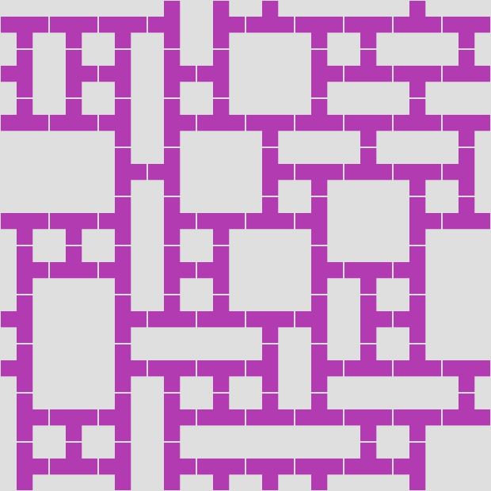

# wave-function-collapse-lua
simple algorithm to create complex structures with simple rules (which neighbours are allowed)

## Usage

after installing Lua (ie via homebrew: brew install lua)
and imagemagick (ie via homebrew: brew install imagemagick)

enter in terminal: 
```bash
lua main.lua
```
result: "demo.png" (dim=10x10)
```bash
random seed = 1684593446
4	 4	 4	 5	 3	 2	 4	 4	 2	 4
5	 3	 5	 3	 5	 1	 3	 2	 4	 2
2	 2	 5	 3	 2	 4	 2	 4	 2	 4
1	 1	 3	 5	 1	 3	 4	 2	 4	 5
4	 4	 5	 3	 4	 2	 5	 1	 3	 2
3	 2	 5	 3	 5	 1	 3	 4	 5	 1
5	 1	 3	 2	 2	 4	 5	 3	 5	 1
5	 1	 3	 4	 4	 5	 3	 2	 2	 4
3	 4	 5	 3	 2	 2	 2	 4	 4	 2
3	 2	 5	 3	 4	 4	 4	 2	 5	 1
```
<div align="left"></div> 

You can set/alter the dimension (size) and the outputname in the file "main.lua" 

build with this tileSet:

 = 1  
 = 2  
 = 3  
 = 4  
 = 5  
*************
This program is free software. It is distributed in the hope that it will be useful, but WITHOUT ANY WARRANTY, without even the implied warranty of MERCHANTABILITY or FITNESS FOR A PARTICULAR PURPOSE. 
*************
