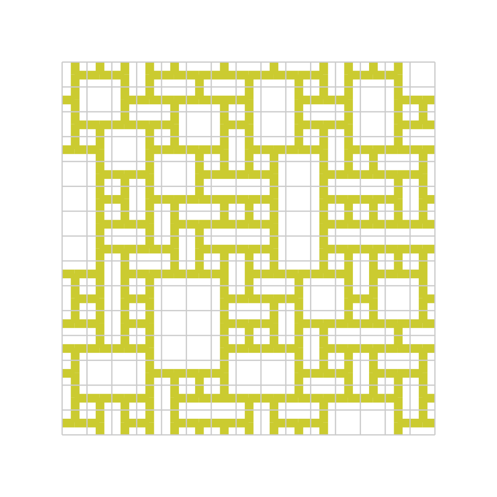

# wave-function-collapse-lua
simple algorithm[^1] to create complex structures with simple rules (which neighbours are allowed)

## Usage

after installing Lua (ie via homebrew: brew install lua)
and ghostscript (ie via homebrew: brew install ghostscript) for use of ps2pdf

enter in terminal: 
```bash
lua main.lua
```
result: "demo.pdf" (dim=10x10)
```bash
random seed = 1717255150
wfc.rand5()
dimx = 	15
dimy = 	15
225 cicles calculated
0 errors!
```
<div align="left"></div> 

You can set/alter the dimension (size) and the outputname in the file "main.lua" 

build with this tiles:

1-5 (1=blank): 
<div align="left"></div> 

Futher informations and descriptions: https://github.com/mxgmn/WaveFunctionCollapse

[^1]: Wave Function Collapse (WFC) is an algorithm developed by Maxim Gumin based on work by Paul Merrell for generating tile based images based off simple configuration or sample images
*************
This program is free software. It is distributed in the hope that it will be useful, but WITHOUT ANY WARRANTY, without even the implied warranty of MERCHANTABILITY or FITNESS FOR A PARTICULAR PURPOSE. 
*************
